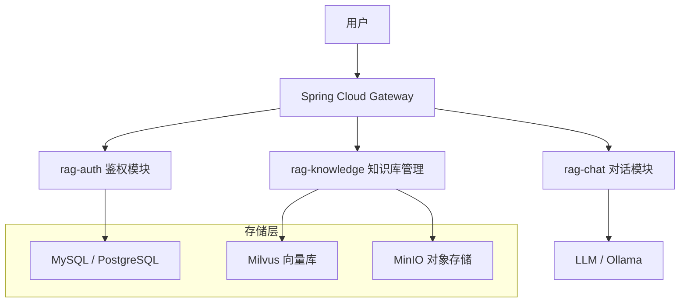

<div align="center">
  <h1>GuideRAG</h1>
  <p><b>工业级多模态 RAG 知识库助手 / Industrial Multi-modal RAG Knowledge Base Assistant</b></p>
  <p>
    
    
    
    
  </p>
</div>

---

## 🌟 项目简介

**GuideRAG** 是一款专注于工业级应用场景的多模态 RAG（检索增强生成）知识库助手。它基于 Spring Boot 微服务架构和 LangChain4j 编排框架，结合高效的向量数据库 Milvus，旨在为企业提供高性能、可扩展的知识管理与 AI 对话解决方案。

### 核心特性

- **🚀 高性能微服务架构**：基于 Spring Boot 3 和 Spring Cloud Alibaba 深度优化。
- **🧠 强大的 RAG 编排**：利用 LangChain4j 提供灵活的 LLM、Embedding 和 Retriever 集成。
- **🖼️ 多模态支持**：支持文档、图片及复杂数据的混合检索。
- **📊 工业级向量数据库**：集成 Milvus，支持大规模、高并发的数据检索。
- **🛡️ 安全与权限**：统一的鉴权网关与用户权限管理。
- **🎨 极速前端响应**：基于 Vue 3 + Vite + TypeScript 构建，流畅的流式输出体验。

## 🏗️ 系统架构



## 🛠️ 技术栈

### 后端 (Backend)
- **核心框架**: Spring Boot, Spring Cloud Alibaba
- **AI 编排**: LangChain4j 
- **向量数据库**: Milvus 
- **对象存储**: MinIO
- **持久层**: MyBatis, PostgreSQL
- **网关鉴权**: Spring Cloud Gateway, JWT

### 前端 (Frontend)
- **框架**: Vue 3, TypeScript, Vite
- **状态管理**: Pinia
- **UI 组件**: Lucide Icons, Markdown-it
- **网络请求**: Axios

## 🚀 快速开始

### 1. 环境准备
确保您的机器已安装：
- **Docker & Docker Compose**
- **JDK 21**
- **Maven**

### 2. 启动依赖中间件 (Milvus, MinIO, etcd)
```bash
docker-compose -f docker-compose.milvus.yml up -d
```

### 3. 配置数据库
创建名为 `guide_rag` 的数据库，并导入 `/src/main/resources/sql/init.sql`（如果存在，请确认对应模块的 SQL 文件）。

### 4. 启动后端项目
按顺序启动以下微服务：
1. `rag-gateway` (端口: 8080)
2. `rag-auth`
3. `rag-knowledge`
4. `rag-chat`

### 5. 启动前端项目
```bash
cd frontend
npm install
npm run dev
```
访问 `http://localhost:3000` 开始体验。

## 🤝 参与贡献
我们非常欢迎您的参与！请在开始之前阅读我们的 [Contributing Guide](CONTRIBUTING.md)。

## 📝 许可证
本项目采用 [Apache License 2.0](LICENSE) 协议开源。

---


